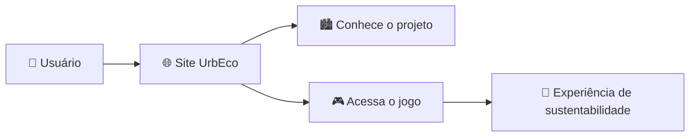

# 🌱 UrbEco

<p align="center">
  
  
  
  
  
</p>

<p align="center">
  <strong>Construa cidades sustentáveis. Transforme o futuro.</strong>
</p>

<p align="center">
  <a href="https://mxengine-code.github.io/UrbEco/">
    
  </a>
  <a href="https://github.com/MxEngine-code/UrbEco">
    
  </a>
</p>

---

## 📌 Sobre o projeto

**UrbEco** é um projeto desenvolvido para a **ProjETE 2K26**, com a proposta de utilizar a tecnologia e a gamificação para abordar o desenvolvimento de **cidades mais sustentáveis**.

O projeto combina um jogo com uma página web de apresentação, permitindo que o usuário conheça a proposta, a equipe e tenha acesso ao jogo.

> 🌎 **A proposta é transformar conceitos de sustentabilidade urbana em uma experiência interativa e educativa.**

---

## 🎮 Experimente o UrbEco

<div align="center">

### 🏙️ Construa. Decida. Transforme.

Acesse o site oficial e conheça o projeto:

**[▶️ JOGAR / ACESSAR O URBECO](https://mxengine-code.github.io/UrbEco/)**

</div>

---

## 🧭 Navegação

* [🌱 Sobre o projeto](#-sobre-o-projeto)
* [🎮 Experimente](#-experimente-o-urbeco)
* [🎯 Objetivo](#-objetivo)
* [⚙️ Tecnologias](#️-tecnologias)
* [📂 Estrutura](#-estrutura-do-projeto)
* [👥 Equipe](#-equipe)
* [🚧 Desenvolvimento](#-status-do-desenvolvimento)
* [📋 Próximos passos](#-próximos-passos)

---

## 🎯 Objetivo

O principal objetivo do **UrbEco** é apresentar, de forma interativa, conceitos relacionados à **sustentabilidade e ao planejamento urbano**.

Por meio da experiência proporcionada pelo jogo, o projeto busca estimular a reflexão sobre decisões que podem influenciar o desenvolvimento de uma cidade.

### 🌎 Principais conceitos

* 🏙️ Desenvolvimento urbano
* 🌱 Sustentabilidade
* ♻️ Consciência ambiental
* 🧠 Tomada de decisões
* 🎮 Gamificação
* 📚 Aprendizado interativo

---

## ⚙️ Tecnologias

O projeto utiliza tecnologias web para desenvolver sua página de apresentação e seus recursos de interação.

| Tecnologia       | Utilização                       |
| ---------------- | -------------------------------- |
| 🌐 **HTML5**     | Estrutura das páginas            |
| 🎨 **CSS**      | Estilização e identidade visual  |
| ⚡ **JavaScript** | Interatividade e funcionalidades |
| ⚡ **Java Nativo** | Interatividade e funcionalidades no app android |
| ⚡ **Xml** | Interatividade e funcionalidades |
| ⚡ **Pixilart** | Criação das pixel art |
| ⚡ **Python** | Parcialmente funcionalidades no app android |
| ⚡ **Firebase** | Comunicação de dados do site ao urbeco_reports |
| ⚡ **Vb.net** | Interatividade e funcionalidades no app windows |
| ⚡ **WindowsForms** | Design e criação das janelas app windows |
| ⚡ **Sql** | Comunicação ao firebase |
| ⚡ **Visual studio 2026** | IDE usada para o app windows |
| ⚡ **Visual studio code** | Editor usado para html, css, js e python |
| ⚡ **Sketchware** | IDE para o app android (java e xml) |
| 🎮 **GameMaker** | Desenvolvimento do jogo          |

---

## 📂 Estrutura do projeto

```text
UrbEco/
│
├── 📁 files/
│   └── Arquivos relacionados ao projeto
│
├── 📄 index.html
├── 📄 aboutus.html
├── 📄 download.html
│
├── 🎨 style.css
├── 🎨 styled.css
│
├── ⚡ script.js
│
└── 📘 README.md
```

---

<details>
<summary><strong>🔎 Clique para conhecer os arquivos</strong></summary>

### `index.html`

Página principal do projeto, responsável pela apresentação inicial do UrbEco.

### `aboutus.html`

Página destinada à apresentação da equipe e informações sobre o projeto.

### `download.html`

Página destinada ao acesso/download do jogo.

### `style.css`

Arquivo responsável pela estilização da página principal.

### `styled.css`

Folha de estilos complementar utilizada pelo projeto.

### `script.js`

Arquivo responsável pelas funcionalidades e interações implementadas em JavaScript.

### `files/`

Diretório utilizado para armazenar arquivos relacionados ao projeto.

</details>

---

## 🧩 Como o projeto funciona



---

## 🛠️ Desenvolvimento

O projeto está sendo desenvolvido de forma progressiva. Após a análise da versão atual do jogo, a equipe trabalha na **correção de problemas identificados e na implementação de melhorias**, buscando aprimorar a experiência do usuário e avançar para a conclusão da versão final.

### 🔄 Etapas do desenvolvimento

* [x] 🌐 Criação da página inicial
* [x] 🎨 Desenvolvimento da identidade visual inicial
* [x] 📥 Criação da página de download
* [x] 📥 Criação da página de feedback
* [x] 📥 Criação da página de inicial do site
* [x] 📥 Criação da página sobre o projeto
* [x] 📄 Organização inicial do projeto
* [ ] 🐛 Correção de problemas identificados
* [ ] ⚙️ Implementação de melhorias
* [ ] 🎮 Finalização do jogo
* [ ] 🧪 Testes finais
* [ ] 🚀 Versão final

---

## 🚧 Status do desenvolvimento

**🟡 Em desenvolvimento**

O UrbEco encontra-se em fase de aprimoramento. A equipe está realizando ajustes e correções com o objetivo de finalizar o jogo e disponibilizar uma versão mais completa do projeto.

---

## 📋 Próximos passos

| Etapa          | Objetivo                                   | Status |
| -------------- | ------------------------------------------ | ------ |
| 🔍 Análise     | Identificar problemas e pontos de melhoria | ✅      |
| 🐛 Correções   | Solucionar problemas encontrados           | 🔄     |
| ⚙️ Melhorias   | Aprimorar funcionalidades e experiência    | 🔄     |
| 🎮 Finalização | Concluir o desenvolvimento do jogo         | ⏳      |
| 🧪 Testes      | Verificar funcionamento da versão final    | ⏳      |
| 🚀 Publicação  | Disponibilizar a versão final              | ⏳      |

---

## 👥 Equipe

Projeto desenvolvido pela equipe **UrbEco — ProjETE 2K26**.

| Integrante           | Atuação                                    |
| -------------------- | ------------------------------------------ |
| 👨‍💻 **João Lucas Fernandes** | Desenvolvimento e documentação do projeto |
| 👨‍💻 **Pablo**      | Desenvolvimento e aprimoramento do projeto |
| 👨‍💻 **Guilherme**      | Sprites, música, documentação do projeto |
| 👨‍💻 **Gustavo Vicente**      | Sprites |

> A equipe atua de forma colaborativa nas etapas de desenvolvimento, testes, correções e evolução do jogo.

---

## 🌐 Links

| Recurso            | Acesso                                                    |
| ------------------ | --------------------------------------------------------- |
| 🎮 **Site / Jogo** | [Acessar UrbEco](https://mxengine-code.github.io/UrbEco/) |
| 💻 **Repositório** | [GitHub](https://github.com/MxEngine-code/UrbEco)         |

---

## 🌱 Proposta

> **“Construa cidades sustentáveis.”**

O UrbEco utiliza a interatividade como forma de aproximar o público de questões relacionadas ao desenvolvimento urbano e à sustentabilidade, transformando o aprendizado em uma experiência prática e envolvente.

---

<p align="center">
  <strong>🌱 UrbEco • ProjETE 2K26</strong>
  <br>
  <sub>Desenvolvendo ideias para cidades mais sustentáveis.</sub>
</p>
